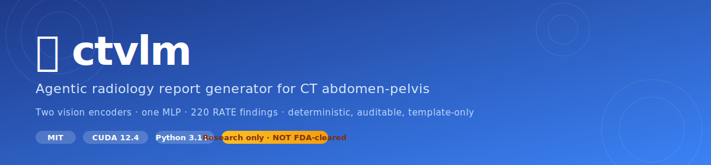
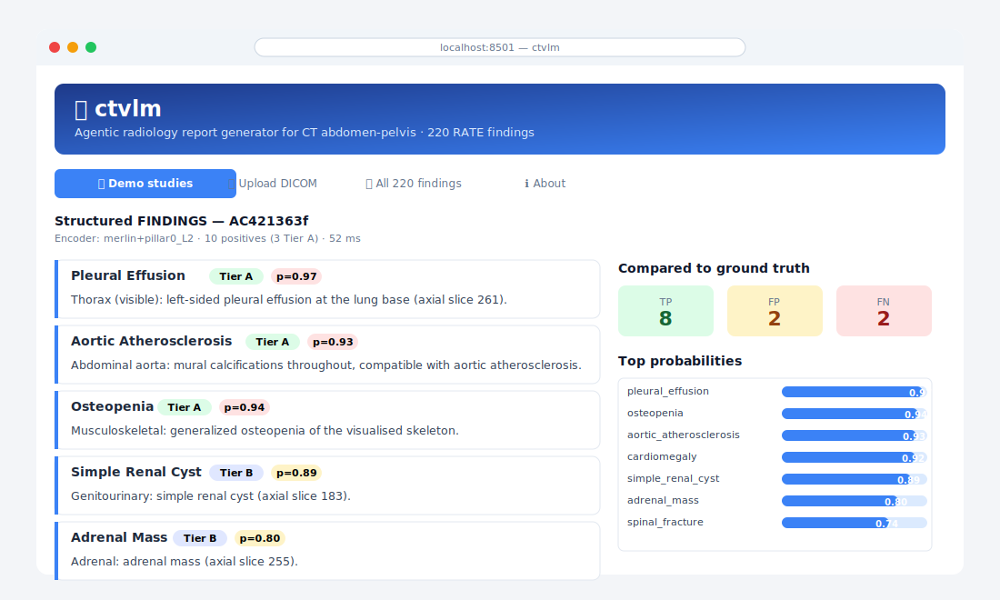
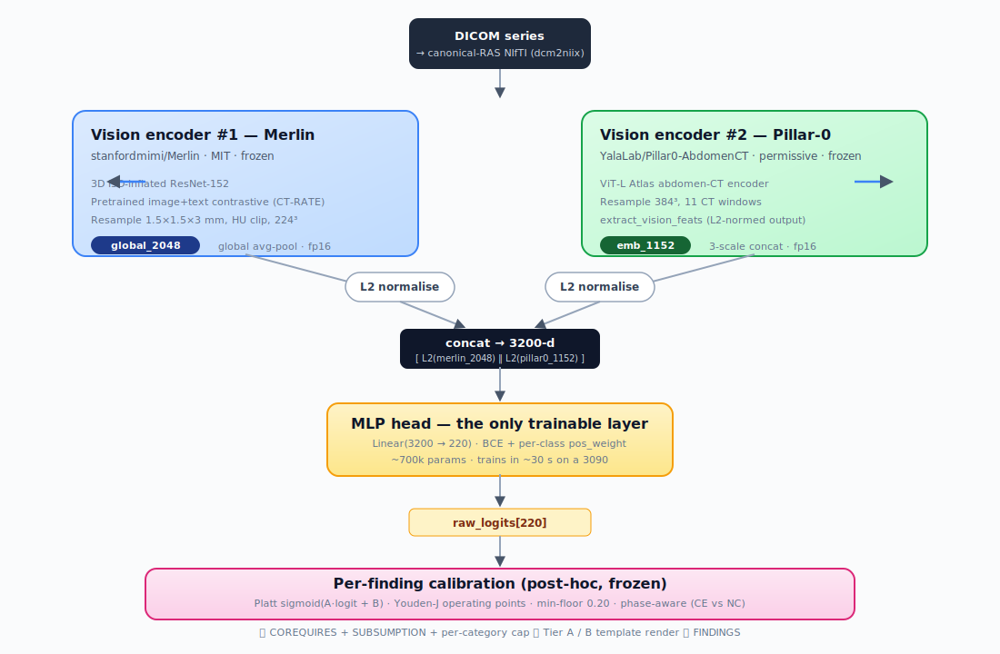
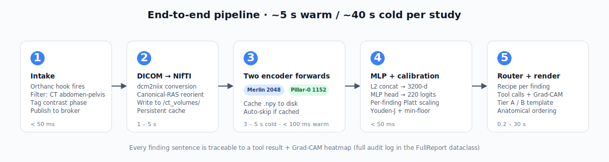

<div align="center">



[](LICENSE)
[](pyproject.toml)
[](Dockerfile)
[](docker-compose.yml)
[](#legal-disclaimer)

[**Demo →**](#demo)  ·  [**Architecture →**](#architecture)  ·  [**Docs →**](docs/01_OVERVIEW.md)  ·  [**Limitations →**](#legal-disclaimer)

</div>

---

## Demo

Drop a DICOM series into the web app, get a structured FINDINGS block in ~5 seconds.

<div align="center">



</div>

### What you'll see

Given a portal-venous-phase CT abdomen-pelvis (study `AC421363f`), the production pipeline outputs:

```
FINDINGS:
  Thorax (visible): left-sided pleural effusion at the lung base (axial slice 261);
                    Heart: enlarged cardiac silhouette (axial slice 248),
                    compatible with cardiomegaly; consolidation (axial slice 295).
  Biliary tree: no intrahepatic or extrahepatic ductal dilation.
  Gallbladder: discrete radiopaque calculi (axial slice 219).
  Adrenal: adrenal mass (axial slice 255).
  Genitourinary: simple renal cyst (axial slice 183).
  Gastrointestinal: enteric diverticula (axial slice 296).
  Abdominal aorta: mural calcifications throughout, compatible with aortic atherosclerosis.
  Retroperitoneum: no lymphadenopathy.
  Musculoskeletal: generalized osteopenia of the visualised skeleton;
                   spinal fracture (axial slice 176); osteosclerotic lesion (axial slice 218).
```

…with every sentence backed by a tool call and Grad-CAM heatmap, every probability calibrated against the held-out validation set.

### Try the web app

```bash
git clone https://github.com/<you>/ctvlm.git && cd ctvlm
cp .env.example .env                   # → set HF_TOKEN
docker compose up viewer                # → http://localhost:8501
```

Three tabs:

| | |
|---|---|
| 🩻 **Demo studies** | 10 pre-cached studies. Pick from a dropdown → see structured findings + per-finding probability table + ground-truth comparison. **No GPU needed**, runs in <100 ms. |
| 📤 **Upload DICOM** | Drag-drop a DICOM series → `dcm2niix` → run Merlin + Pillar-0 encoders → full RATE-225 prediction. Features cache to disk so re-running is instant. |
| 🧭 **All 220 findings** | Taxonomy explorer. Filter by category, search by name, see per-finding probability from the current study. |

There's also a static [landing page](landing/index.html) you can serve from GitHub Pages.

---

## Headline performance

Evaluated on the held-out 5,082-study val split of the 25,414-case RATE-labelled cohort.

| | micro P | micro R | micro F1 |
|---|---|---|---|
| **Contrast-enhanced** (5,042 val cases) | **0.503** | **0.557** | **0.529** |
| Non-contrast, default calibration (40 val cases) | 0.467 | 0.562 | 0.510 |
| Non-contrast, phase-aware calibration (40 val cases) | 0.475 | 0.568 | 0.517 |

Probe-level macro AUROC: **0.853** across all 220 findings, **0.873** across the 11 anchor findings (`ascites`, `hepatic_steatosis`, `splenomegaly`, `cirrhosis`, `hepatic_cyst`, `simple_renal_cyst`, `renal_stones`, `pleural_effusion`, `lymphadenopathy`, `aortic_atherosclerosis`, `acute_pancreatitis`).

Full numbers — including per-finding AUROC, top systematic FPs/FNs, and the contrast-stratified breakdown — in [docs/10_PERFORMANCE.md](docs/10_PERFORMANCE.md).

---

## Architecture

**Two frozen vision encoders → concatenation with L2 normalisation → single MLP head → 220 calibrated finding probabilities → deterministic tool router → template-rendered FINDINGS block.**

<div align="center">



</div>

### End-to-end runtime

<div align="center">



</div>

### Why two encoders?

The two encoders carry **complementary signal** (validated in `reports/concat_ablation.md`):

- **Merlin** wins on diffuse / cross-organ / fluid findings: ascites, splenomegaly, cirrhosis, pleural_effusion, lymphadenopathy, pancreatitis. Image-text contrastive pretraining tunes its global avgpool to whole-volume patterns.
- **Pillar-0** wins on organ-localised focal findings: hepatic_steatosis, hepatic_cyst, renal_cyst. Atlas registration pretraining tunes per-organ tissue character.

L2-norming each before concat matters — Pillar-0 emb has unit norm by design, Merlin global has norm ~23. Raw concat under-uses Pillar-0; L2-normalised concat picks up the +0.022 matched-macro that complementarity is worth.

### Why only the MLP is trained

Both encoders are gated by their respective licenses (Merlin MIT, Pillar-0 permissive) and trained on much larger CT corpora than we have. Freezing them lets us:

- Train the head in **30 seconds** on a 3090 (vs. days of encoder pretraining)
- Re-calibrate or retarget findings without re-extracting features
- Inherit the encoders' generalisation
- Provide encoder-side audit (per-encoder Grad-CAM via weight-slot splits)

A dedicated experiment (`scripts/43_pillar0_lora.py`) tried adapting Pillar-0 with LoRA. The aggressive config caused catastrophic forgetting; the conservative config matched the frozen baseline on the 10k-case directional eval. Encoders stay frozen.

### Why no LLM in the production path

The codebase includes a MedGemma-4B + LoRA prose layer for research, but it's **disabled in production**. The LLM hallucinated concrete measurements and prior-study references that weren't in the structured input. Template-only output is:

- **Deterministic** — same input → same output, always
- **100% auditable** — every measurement, side, slice, HU value comes from a tool call
- **Sub-millisecond** for the render step (no model load, no GPU)

If you want radiology-style natural prose, a post-render regex filter that drops sentences introducing tokens not in the structured input is the recommended approach. Not shipped.

---

## Quick start

### Docker (recommended)

```bash
git clone https://github.com/<you>/ctvlm.git
cd ctvlm

# 1. Set your HuggingFace token (one-time, for the auto-download)
cp .env.example .env
# → edit .env, set HF_TOKEN=hf_... after accepting the Merlin + Pillar-0 gates

# 2. Launch
docker compose up viewer
# → On FIRST start: container pulls Merlin (~1.1 GB) + Pillar-0 (~356 MB)
#   from HuggingFace into ./hf_cache (volume-mounted so subsequent launches are instant).
# → Open http://localhost:8501
```

### Python

```bash
pip install -e .
./scripts/download_weights.sh

# Single-study end-to-end (skip_llm=True is the production default)
python -c "
from src.agent import pipeline
report = pipeline.generate_report('AC421363f', skip_llm=True, contrast_phase='ce')
print(report.summary_text)
"
```

### Smoke test

```bash
python scripts/smoke_test.py
# Expected: 4 steps PASS (imports, canonical map, probe checkpoint, encoder load)
```

### Thor deployment

For the `thor` host, use the dedicated Compose profile:

```bash
cp .env.example .env
docker compose -f docker-compose.thor.yml up -d viewer
```

See [deploy/thor/README.md](deploy/thor/README.md) for the runbook, storage layout,
smoke checks, and rollback steps.

---

## Datasets

This repo bundles:

- **RATE labels** (`data/finding_labels_rate.csv`) — 25,494 studies × 230 binary finding columns
- **Source radiology reports** (`data/reports_25k.csv`) — original report text, 55 MB
- **Canonical name map** (`data/rate_canonical_map.csv`) — 225 RATE questions → 220 canonical names
- **Non-contrast SIDs** (`data/noncontrast_sids.txt`) — 190 studies tagged non-contrast (for phase-aware calibration)
- **Trained MLP head checkpoint** (`checkpoints/concat_rate_probe.pt`) — Platt + Youden-J + NC-specific calibration baked in
- **10 demo studies** (`data/demo_features/`) — pre-cached encoder features for the web app's demo tab

The CT volumes themselves are **not bundled**. Download separately:

| asset | source | notes |
|---|---|---|
| Merlin Abdominal CT dataset | [stanfordmimi/Merlin](https://huggingface.co/datasets/stanfordmimi/Merlin) on HF Datasets | Gated, accept terms |
| Stanford AIMI dataset portal | [aimi.stanford.edu/shared-datasets](https://aimi.stanford.edu/shared-datasets) | Alternative download |
| Azure Open Datasets — Medical Imaging | [learn.microsoft.com/.../dataset-medical-imaging](https://learn.microsoft.com/en-us/azure/open-datasets/dataset-medical-imaging) | Azure-hosted mirror |
| **Merlin encoder weights** | [stanfordmimi/Merlin](https://huggingface.co/stanfordmimi/Merlin) | MIT. Auto-pulled by Docker on first launch. |
| **Pillar-0 encoder weights** | [YalaLab/Pillar0-AbdomenCT](https://huggingface.co/YalaLab/Pillar0-AbdomenCT) | Permissive. Auto-pulled by Docker on first launch. |

---

## Repo layout

```
├── README.md
├── LICENSE                              # MIT + third-party notes
├── CITATION.cff
├── Dockerfile                           # multi-stage: base + viewer + worker
├── docker-compose.yml                   # ports, volumes, env, GPU
├── .env.example                         # HF_TOKEN template
├── pyproject.toml                       # ctvlm 0.2.0
│
├── docs/                                # 13 markdown files
│   ├── 01_OVERVIEW.md                   # architecture + component map
│   ├── 02_INSTALLATION.md               # hardware, env vars, FS layout
│   ├── 03_PYTHON_API.md                 # generate_report() contract
│   ├── 04_DATA_PIPELINE.md              # DICOM → report stages
│   ├── 05_ORTHANC_INTEGRATION.md        # receiver hook + DICOM tags
│   ├── 06_GPU_BROKER_INTEGRATION.md     # worker pattern + memory
│   ├── 07_CALIBRATION.md                # Platt + Youden-J + contrast
│   ├── 08_FINDINGS_TAXONOMY.md          # 220 canonicals + recipes
│   ├── 09_GRAD_CAM.md                   # heatmap generation + NiiVue
│   ├── 10_PERFORMANCE.md                # full eval numbers
│   ├── 11_LIMITATIONS.md                # known FP/FN + regulatory
│   ├── 12_OPERATIONS.md                 # logs, metrics, runbook
│   └── 13_MODEL_WEIGHTS.md              # weights install + offline
│
├── viewer/
│   ├── web_app.py                       # user-facing Streamlit (Docker default)
│   ├── streamlit_app.py                 # power-user dashboard
│   ├── ct_files_server.py               # NIfTI / heatmap streaming + NiiVue page
│   └── README.md
│
├── deploy/                              # Orthanc + GPU-broker reference scripts
│   ├── example_orthanc_hook.py
│   ├── example_worker.py
│   ├── example_dicom_to_nifti.py
│   └── README.md
│
├── landing/
│   └── index.html                       # static GitHub Pages landing
│
├── src/                                 # production code
│   ├── agent/                           # pipeline, recipes, router, tools, templates, render, schema, canonical, cache
│   ├── embeddings/                      # merlin + pillar0 loaders
│   ├── data/                            # CT + organ-mask loaders
│   ├── explain/                         # Grad-CAM
│   └── config.py
│
├── scripts/
│   ├── 41_merlin_rate_probe.py          # retraining / re-calibration
│   ├── download_weights.sh              # Merlin + Pillar-0 from HF
│   ├── startup.sh                       # container ENTRYPOINT (auto-download)
│   └── smoke_test.py
│
├── checkpoints/
│   └── concat_rate_probe.pt             # trained MLP head + calibration
│
├── data/
│   ├── rate_canonical_map.csv
│   ├── noncontrast_sids.txt
│   ├── finding_labels_rate.csv
│   ├── reports_25k.csv
│   └── demo_features/                   # 10 cached studies for the web app
│
├── configs/paths.yaml                   # path config (env-var overridable)
└── tests/                               # production tests
```

---

## Legal disclaimer

### Regulatory status

> **⚠️ This software is NOT FDA-cleared, NOT CE-marked, and is NOT certified for clinical decision support.**
>
> It is **research software**, intended only for research, prototyping, and exploration of automated radiology report generation. Output may be incorrect, incomplete, or misleading.
>
> **Do not use as a sole basis for any clinical decision.** Every output must be reviewed by a qualified, licensed radiologist before it is used in any patient-care context.

### What can go wrong

- The model is trained on a single-institution US tertiary-care cohort (Merlin Abdominal CT dataset, Stanford). External validity on other populations, scanners, or protocols is unverified.
- Approximately 99% of training was contrast-enhanced. Non-contrast performance is measurably worse (micro F1 0.510 vs. 0.529 on the validation split).
- The model **does false positives** at a meaningful rate (top systematic FPs across val: `lymphadenopathy` 21%, `renal_hypodensity` 20%, `atelectasis` 18%, `coronary_atherosclerosis` 17%, `simple_renal_cyst` 16%).
- The model **does false negatives** at a meaningful rate (top: `bowel_obstruction`, `lung_mass`, `renal_hypodensity`, `ascites`, `hepatic_steatosis`).
- The pipeline is calibrated for adult abdomen-pelvis CT only. Pediatric studies, chest-only studies, trauma fast scans, and post-operative studies are out of distribution.
- The Grad-CAM heatmaps are a *post-hoc* explanation of the model's attention, not a guarantee of correctness.

### Data privacy and HIPAA

- This software receives DICOM data from your Orthanc / PACS / worker environment. It does **not** transmit data off-host (except for the one-time HuggingFace encoder weights download on container startup, which is one-way and contains no patient data).
- Bundled training labels and source reports are derived from the public Merlin Abdominal CT dataset and are redistributed under its research-use terms.
- You are responsible for ensuring that your deployment environment, network configuration, log retention, and access controls comply with HIPAA, GDPR, your IRB protocol, and any other applicable regulations.

### Liability and warranty

This software is provided **"as is", without warranty of any kind**, express or implied, including but not limited to the warranties of merchantability, fitness for a particular purpose, and non-infringement. In no event shall the authors or copyright holders be liable for any claim, damages, or other liability arising from, out of, or in connection with the software or its use.

See [LICENSE](LICENSE) for the full MIT license and third-party asset terms.

Full limitations breakdown, known FP/FN patterns, and out-of-distribution boundaries: [docs/11_LIMITATIONS.md](docs/11_LIMITATIONS.md).

---

## Citing

If this code or the bundled probe is useful in your work:

```bibtex
@misc{ctvlm2026,
  title  = {ctvlm: Agentic Radiology Report Generation for CT Abdomen-Pelvis},
  year   = {2026},
  url    = {https://github.com/<owner>/ctvlm},
  note   = {Built on stanfordmimi/Merlin and YalaLab/Pillar0-AbdomenCT encoders;
            calibrated against RATE-225 labels.}
}
```

Plus the foundational works:

- **Merlin** — Bluethgen et al., Stanford. [HF](https://huggingface.co/stanfordmimi/Merlin)
- **Pillar-0** — YalaLab Atlas abdomen-CT encoder. [HF](https://huggingface.co/YalaLab/Pillar0-AbdomenCT)
- **NiiVue** — Rorden et al., WebGL2 medical-imaging viewer. [GitHub](https://github.com/niivue/niivue)

---

## Contributing

PRs welcome. The code-quality contract:

- Production tests in `tests/` must pass
- No LLM dependency in the production path (`src/agent/pipeline.py`)
- Calibration changes require a re-eval against the val split before merging — see `scripts/41_merlin_rate_probe.py` for the retraining + calibration recipe
- Add a docs section if you change anything user-visible

See [docs/12_OPERATIONS.md](docs/12_OPERATIONS.md) for the change-management runbook.

## License

MIT — see [LICENSE](LICENSE). Third-party asset terms (Merlin, Pillar-0, source dataset) noted in the LICENSE file.

---

<div align="center">

**Research use only · NOT FDA-cleared · Built on Merlin + Pillar-0**

[Docs](docs/01_OVERVIEW.md) · [Limitations](docs/11_LIMITATIONS.md) · [License](LICENSE) · [Citing](#citing)

</div>
